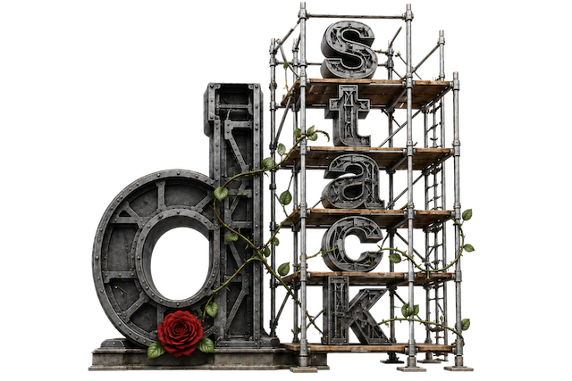

# dstack

<p align="center">
  
</p>

A documentation-first, Beads-backed workflow for agent-assisted software projects. The repository is both an installable
Skills CLI package and a versioned Copier template.

## Install

```bash
npx skills@latest add RobertDeRose/dstack
```

The command discovers all skills under `skills/` and lets you choose skills and target agents. Install every skill
non-interactively with:

```bash
npx skills@latest add RobertDeRose/dstack --all
```

Supporting scripts, references, and the complete Copier template are installed recursively with their owning skills.

## Create a New Project

From the target directory:

```text
/setup-project
```

The project name defaults to `basename "$PWD"`. Override it explicitly:

```text
/setup-project Reader Control Plane
```

The setup skill resolves the newest stable dstack tag, verifies its installed template matches that exact commit,
renders the bundle, and records the SHA as the future update baseline. Pass `--unstable` to render and record the source
default-branch HEAD instead. It creates `.copier-answers.yml`, initializes Git when needed, initializes Beads when
available, and validates the documentation scaffold. It is strictly a new-project workflow: it does not generate
bootstrap or migration scripts and does not merge an existing repository. If `.copier-answers.yml` already exists,
`/setup-project` asks whether to run `/update-project` and proceeds only after explicit approval. Other existing project
files are routed to `/migrate-workflow`.

`/setup-project` collects the structured brief interactively. Direct invocation for a Codex/universal project
installation supplies the same required fields explicitly:

```bash
uv run .agents/skills/setup-project/scripts/setup-project.py "Reader Control Plane" \
  --purpose "Coordinate reader devices from one control plane." \
  --users "Operators responsible for reader fleets." \
  --scope "Provisioning and health workflows for supported readers." \
  --boundaries "Firmware and identity-provider administration remain external." \
  --project-kind service
```

## Update Skills and Generated Projects

These are separate operations:

```bash
# Update installed skill definitions, scripts, and bundled assets.
npx skills update

# Apply template changes through the repository's recorded channel.
/update-project
```

The project update helper first checks Copier state, legacy `tasks.md` files, and initialized Beads state. When active
legacy task files exist without Beads, `/update-project` offers `/migrate-workflow` and runs it only after approval.
Otherwise it reads the Git source and channel recorded in `.copier-answers.yml`: `stable` selects the newest stable PEP
440 tag and `unstable` selects the source default-branch HEAD. It resolves and persists the exact commit before Copier's
three-way update. Project-specific evolution is preserved where possible. Use `--stable` or `--unstable` to change the
preserved channel and `--vcs-ref` only for an explicitly reviewed one-shot revision.

## Migrate an Existing Project

For a repository using the original `planned-features.md` plus per-feature `tasks.md` workflow:

```text
/migrate-workflow
```

The migration skill renders the latest tagged new-project template with Copier into an isolated directory, copies
missing workflow files, stages conflicting project-owned files as explicit manual-merge candidates, backs up and rebases
existing Copier state to the adopted tagged template, initializes Beads, migrates live task state, and archives legacy
task files after verification. It does not overwrite project-specific navigation or product documentation wholesale.

## Feature Workflow

```text
/plan-features
/start-feature feature-name
/implement-feature feature-name
/close-feature feature-name
/audit-project
```

Each feature is one Beads epic, or a molecule when created from the lifecycle formula. Lifecycle gates and bounded
implementation tasks live below that epic. Human workflow commands use the stable `<slug>` or feature name; opaque Beads
IDs remain internal mutation and audit references.

## Commit scopes

Changelog-visible commits use the scope for the subsystem that owns the change:

| Scope       | Use                                                                                             |
|-------------|-------------------------------------------------------------------------------------------------|
| `audit`     | Reconciliation records, implementation evidence, and corrected commit references.               |
| `docs`      | Documentation architecture, mdBook, navigation, link validation, and reader pages.              |
| `github`    | GitHub Actions, Pages, permissions, and repository integration.                                 |
| `profiles`  | Language profiles generated by the Copier template, including tools, checks, and documentation. |
| `repo`      | Repository-level merge, branch, tag, signing, and history policy.                               |
| `skill`     | One specific dstack skill; name the skill in the subject.                                       |
| `template`  | Copier-generated project files, structure, and shared generated contracts.                      |
| `toolchain` | mise, hk, hooks, locks, quality policy, and tool provisioning.                                  |
| `workflow`  | Cross-skill lifecycle, Beads formula, review orchestration, and delivery behavior.              |

Keep this table, the `cog.toml` allowlist, and the commit guidance in `AGENTS.md` synchronized.

## Repository Layout

```text
pyproject.toml                     # package version, pytest, Ruff, and uv configuration
uv.lock                            # reproducible test dependency lock
mise.toml                          # tools and release publication task
copier.yml                         # Git-repository Copier entry point
docs/                              # mdBook usage, architecture, development, and reference documentation
skills/
  dstack-core/
    SKILL.md
    references/TRUST-AND-AUTHORITY.md
    scripts/resolve-feature.py       # human feature selector and next-ready resolver
  setup-project/
    SKILL.md
    copier.yml                     # bundled/local Copier entry point
    scripts/setup-project.py
    template/                      # complete generated-project scaffold
  update-project/
    SKILL.md
    scripts/update-project.py
  migrate-workflow/
    SKILL.md
    scripts/adopt-template.py
    scripts/migrate-legacy-workflow.py
    references/MIGRATION.md
  gh-pr-review/
    SKILL.md
    scripts/fetch_comments.py
    scripts/review_state.py
    scripts/wait_for_review.sh
  ...workflow skills...
tests/
```

Normal setup resolves `gh:RobertDeRose/dstack` through its stable or unstable channel, verifies the installed bundle
matches the exact commit, and records that commit. The nested `skills/setup-project/copier.yml` and root `copier.yml`
remain aligned entry points for local development and tests; skill `metadata.version` is not template provenance.

Every skill declares the synchronized release in frontmatter as `metadata.version` and declares its required tools in
the space-separated `allowed-tools` field.

## Release and Validation

dstack releases use stable `vX.Y.Z` Git tags. Stable setup/update selects the latest eligible tag; unstable setup/update
explicitly selects the source default-branch HEAD. Both record the exact reachable commit.

Prepare a release with the mise task. Python Semantic Release updates `[project].version`, `uv.lock`, and every skill's
`metadata.version`, then creates a signed release commit and signed annotated `v<version>` tag. It does not push unless
requested:

```bash
mise run release
mise run release --push
```

A configured Git signing key is required. Use `mise run release --noop` to inspect the next release without committing
or tagging.

The full documentation and command reference lives in the [dstack book](docs/src/index.md). Validate the repository and
documentation with:

```bash
mise run check
mise run docs:check
```

Use the fast static suite while editing:

```bash
uv run --frozen --group test pytest -m "not integration and not external"
```

Run the local end-to-end Copier and migration suites before opening a pull request:

```bash
uv run --frozen --group test pytest -m integration
```

Run the network-backed Skills CLI smoke test before tagging, or let the scheduled/tag workflow run it:

```bash
uv run --frozen --group test pytest -m external
```

Run everything serially only when a single-process full validation is specifically needed:

```bash
uv run --frozen --group test pytest
```

GitHub Actions runs static validation and the two integration suites as parallel jobs. The external Skills CLI check is
isolated in a scheduled, manually dispatched, and tag-triggered workflow so npm cold-start latency does not slow every
pull request.
