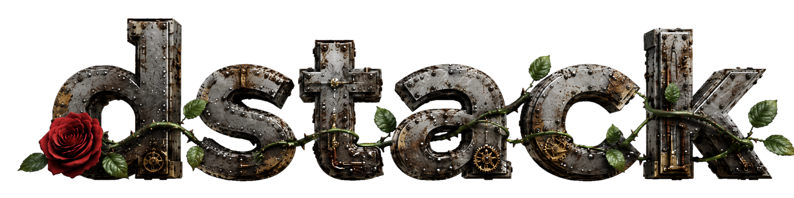

<!-- rumdl-disable-file MD041 -->

<p align="center">
  
</p>

`dStack` is a small installable workflow controller for software engineering with Pi, Beads, and Git. It provides a
`dstack` command for deterministic mechanics and installs short Pi skills for engineering judgment. It is not a workflow
engine and owns no task database, migration store, scheduler, or shadow state.

## Architecture

```text
Pi slash command -> short decision skill -> dstack ctl -> Beads / Git
                    ^
                    |
          compact dStack system guidance
```

- **Beads** owns work, dependencies, gates, readiness, claims, and completion.
- **Git** owns code, tests, durable documentation, commits, and delivery history.
- **dStack CLI** performs deterministic native transitions without storing workflow state.
- **Pi skills/agent** own architecture, implementation, review judgment, and user interaction.

**Central rule:** formulas define how dStack creates and reviews new work; they are not schemas that existing work must
migrate to. Historical Beads remain execution evidence and native readiness remains authoritative. When an approved
feature is explicitly reviewed under a newer formula contract, dStack compares it semantically and asks the user only
when a material design/task delta is actually required.

See the [architecture](docs/src/architecture/index.md), [core principles](docs/src/development/index.md),
[workflow reference](docs/src/development/feature-lifecycle.md), and
[compatibility reference](docs/src/reference/compatibility.md).

## Install

Requirements:

- Git
- Pi
- `uv`
- Python 3.14 (the `uv tool` environment is constrained by `pyproject.toml`)
- Beads 1.2.2 exactly; `bd --version` must print `bd version 1.2.2 (6c124203e)`
- mdBook 0.5.3 exactly on `PATH` when documentation validation is required

Install dStack as a normal Python tool from a checkout:

```bash
uv tool install --python 3.14 /path/to/dstack
```

The `dstack` executable is then available on `PATH`. The first dStack command to run is:

```bash
dstack install_skills
```

`install_skills` idempotently installs/updates:

- dStack decision skills in `~/.pi/agent/skills/`;
- dStack slash-command prompts in `~/.pi/agent/prompts/`; and
- a compact managed dStack block in `~/.pi/agent/APPEND_SYSTEM.md`.

The former `dstack-beads-core` skill is intentionally **not** installed. Its stable CLI guidance, formula-compatibility
behavior, and guardrails live in the system-prompt additive so workflow skills do not spend context rereading the same
core instructions.

Use an alternate Pi agent directory either explicitly or through the environment:

```bash
dstack install_skills --agent-dir /path/to/pi-agent
PI_CODING_AGENT_DIR=/path/to/pi-agent dstack install_skills
```

After installing or upgrading dStack, rerun `dstack install_skills` and reload Pi.

## Commands

```text
/plan-feature [id|slug|title|request]
/plan-features [deprecated alias]
/review-feature-spec [feature]
/implement-feature [feature] [task|--all]
/close-feature [feature] [ready|pr|merge]

/project-alignment-review [scope]
/project-alignment-execute <audit> [task|--all]
/project-alignment-land <audit> [ready|pr|merge]
```

Skills call the installed CLI as `dstack ctl ...`; they contain policy and decision boundaries rather than
package-relative script paths or shell choreography.

The four feature stages are:

- `/plan-feature` — discover what to build and why, preserving planned intent in Beads without changing Git;
- `/review-feature-spec` — materialize/reconcile the design, build the implementation graph, and obtain authorization;
- `/implement-feature` — implement authorized outcomes in code and tests;
- `/close-feature` — perform final reconciliation of intent, implementation, tests, durable documentation, and delivery.

## Formula compatibility

Formula versions are semantic planning/review contract versions, not dStack package versions and not persistent graph
schemas. New work records the current contract version. When an approved active feature is explicitly reviewed under a
newer or unknown contract, the specification-review skill compares the existing design/tasks semantically:

- if current design/tasks already satisfy the contract, run `feature audit-complete` to stamp the current audited
  version;
- if a material delta is required, show only the minimal design/task/dependency delta and ask for renewed approval
  before mutation.

Closed historical work is not rewritten merely because dStack changed. Active historical graphs that do not contain the
current molecule remain native Beads records; dStack does not migrate or normalize them. Finish them with native Beads,
or explicitly plan a new current feature. `/review-feature-spec` audits current molecules only and changes approved work
only after the normal user-authorization boundary.

## Git and Beads linkage

Git commits reference work with one rewrite-safe footer:

```text
Beads: <bead-id>
```

Beads does not store task, implementation, delivery, evidence, or bookkeeping Git SHAs. dStack reconstructs evidence
from current reachable Git history, so amend/rebase/cherry-pick operations require no Beads remapping.

## Documentation policy

mdBook is canonical for managed-project durable documentation. Documentation describes accepted product/design intent
and planned vs implemented behavior; it does not mirror transient workflow state. Implementation tasks do not create
durable documentation work. Feature closeout or alignment landing performs the single final reconciliation.

## Development

The repository keeps `mise.toml`/`mise.lock` for contributor tooling and CI; they are not the installed dStack CLI
launcher.

```bash
uv run pytest
uv run pytest tests/acceptance
```

Real-Beads acceptance requires the supported `bd` binary on `PATH`.
